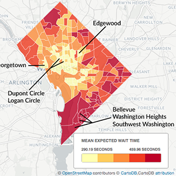
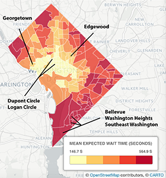
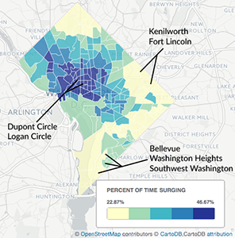
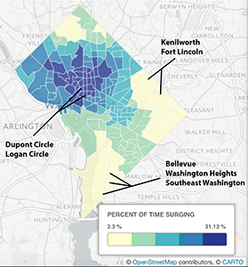
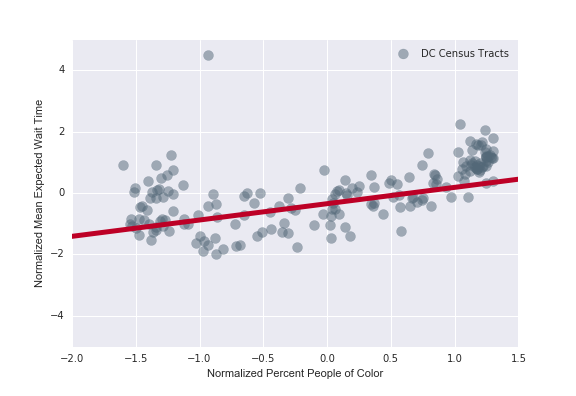
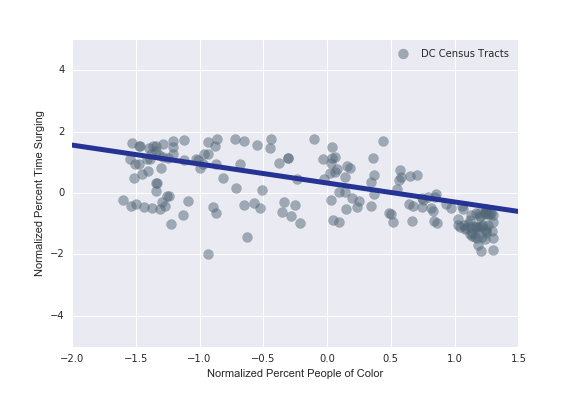

# 2016-03-wapo-uber
__________
# **Correction to** ["Uber seems to offer better service in areas with more white people. That raises some tough questions"](https://www.washingtonpost.com/news/wonk/wp/2016/03/10/uber-seems-to-offer-better-service-in-areas-with-more-white-people-that-raises-some-tough-questions/)
By [Jennifer A Stark](https://github.com/JAStark) and [Nick Diakopoulos](http://www.nickdiakopoulos.com)

**An Issue submitted by romelf#1 alerted us to a bug in our gatherUberData.py script (code copied from [uberpy](https://github.com/comp-journalism/uberpy) repository). We fixed the bug in October 2016, and collected a new Uber dataset, which is available [here](https://drive.google.com/file/d/0B-mutxqHY34rOGZpV0pxem1aYzQ/view?usp=sharing) and [here](https://drive.google.com/file/d/0B-mutxqHY34rdFhCZGkwaWM1LW8/view?usp=sharing).**

This is the default branch and contains all the files from the original Master branch, with a new [UberSurgePricing_OSC.ipynb](LINK) analyzing the new data. The original analysis and code can still be found in the Master branch.

Below we have detailed which values and statements from the [Washington Post article](https://www.washingtonpost.com/news/wonk/wp/2016/03/10/uber-seems-to-offer-better-service-in-areas-with-more-white-people-that-raises-some-tough-questions/) *have* been affected by these changes to the code and new data collected. Importantly, **the overall findings are unaffected by the new data: Better service is offered to areas with a greater proportion of white people.**  Statistical significance is stronger when the analysis is run with the new data, indicating that the bug introduced noise to the data, rather than creating spurious correlations.

Original Statement |  New statement
-------------------|----------------
Some of the tracts most significantly affected by this race-related difference in service are labeled on the map above, including Congress Heights, Bellevue and Washington Highlands, and the southern part of Southwest D.C., where average wait time is **almost seven minutes** for an uberX." | "Some of the tracts most significantly affected by this race-related difference in service are labeled on the map above, including Congress Heights, Bellevue and Washington Highlands, and the southern part of Southwest D.C., where average wait time is over **six and a half minutes** for an uberX."
"In contrast, the tracts benefiting from this race-related difference (majority white tracts with shortest wait time) include Dupont Circle, Logan Circle and Georgetown, where average wait time is just over **four minutes**."  | "In contrast, the tracts benefiting from this race-related difference (majority white tracts with shortest wait time) include Dupont Circle, Logan Circle and Georgetown, where average wait time is just over **three minutes**."
"These areas **surge 43 percent** of the time, which makes them attractive to drivers who want to earn more." | "These areas **surge 27 percent** of the time, which makes them attractive to drivers who want to earn more."
"We found that tracts surged for anywhere from **16 percent to 47 percent** of the time (see next map), with race also predicting how often tracts surge – even when accounting for differences in income, poverty and population density."  |  "We found that tracts surged for anywhere from **two percent to 32 percent** of the time (see next map), with race also predicting how often tracts surge – even when accounting for differences in income, poverty and population density."
" The northwest part of D.C. illustrates this well with several colleges in the area, and an average wait time of just **295 seconds**."  |  " The northwest part of D.C. illustrates this well with several colleges in the area, and an average wait time of just **245 seconds**."
"Despite having 75 percent people of color, Edgewood has an average **wait time of 292 seconds**, which is within the **bottom quarter of shortest wait times**. " | "Despite having 75 percent people of color, Edgewood has an average **wait time of 246 seconds**, which is **quicker than the average wait time of 275 seconds.**. "

Below are detailed the original statistics using a generalized linear model for estimating both Mean Expected Wait Time and Proportion of time surging, and the new Robust regression for each estimation.

Estimating Mean Expected Wait Time coefficients (values in bold are statistically significant at p\<0.05):

Predictor | Original GLM | New Robust Linear model
----------|--------------|-----------------------
percent_POC_zscore | **0.4805** | **0.53318**
medianHourseholdIncome_zscore | -0.1685 | -0.1931
popDensity_zscore | **-0.4006**  | **-0.2896**
pecent_poverty_zscore | -0.213  |  -0.1634
percent_POC_zscore:medianHouseholdIncome_zscore | -0.1328  |  **-0.2675**
percent_POC_zscore:percent_poverty_zscore | **0.3077** |  **0.2133**

Estimating Mean Percentage of Time Surging coefficients (values in bold are statistically significant at p\<0.05):

Predictor | Original GLM | New Robust Linear model
----------|--------------|-----------------------
percent_POC_zscore | **-0.5738** | **-0.6177**
medianHourseholdIncome_zscore | **0.3101** | 0.223
popDensity_zscore | **0.3986**  | **0.3607**
pecent_poverty_zscore | **0.3657**  |  **0.3518**
percent_POC_zscore:medianHouseholdIncome_zscore | **0.2128**  | **0.2202**
percent_POC_zscore:percent_poverty_zscore | -0.1511 |  **-0.2458**

The maps shown in the article are also different.
The original choropleth map for Mean Expected Wait Time (seconds) (left) and the new map (right)

  .

The original choropleth map for Percent Time Surging (%) (left) and the new map (right)
 .

The scatter plot charts shown in the article are also different.
The original scatter plot of the relationship between proportion of POC and mean expected wait time (top) and the new chart (bottom)

   

The original scatter plot of the relationship between proportion of POC and percentage of time surging (top) and the new chart (bottom)

   

__________
## Below is the original README

This is a repository meant to support transparency and reproducibility of the data analysis and visualization presented in the Washington Post article ["Uber seems to offer better service in areas with more white people. That raises some tough questions"](https://www.washingtonpost.com/news/wonk/wp/2016/03/10/uber-seems-to-offer-better-service-in-areas-with-more-white-people-that-raises-some-tough-questions/)

If you have cloned this repo and downloaded the raw [Uber data](NEW LINK),
you can reproduce the analysis in this [notebook](NEW LINK).

## The Data
### Collecting data with the Uber API
Data were collected using the Uber API with config.config and gatherUberData.py -
based on scripts of the same name from our [uberpy](https://github.com/comp-journalism/uberpy)
project.

`config.config` was modified to collect data every 3 minutes, provided a list of 276
locations across DC, and provided a list of [Uber API](https://developer.uber.com/) keys.

`gatherUberData.py` was modified to save data with the DC local datetime.

###Sampling the Data using [get_geographic_data.ipynb](https://github.com/comp-journalism/2016-03-wapo-uber/blob/master/get_geographic_data.ipynb) in Python2 (the only part requiring Python2) followed by [Mapping_points_across_DC.ipynb](https://github.com/comp-journalism/2016-03-wapo-uber/blob/master/Mapping_points_across_DC.ipynb) in Python3.
The method for determining the 276 locations in DC to sample used the following steps:
* A 22 x 22 grid of longitudes and latitudes was applied across DC
* Addresses were then associated with each point using `Nominatim` from `geopy.geocoders` (installed with `pip`). Any point not in DC was removed.
* Remaining addresses were then validated to require a house number and street prefix using `address.AddressParser` (installed with `pip`). This removed points that fell in the river or parks etc.
* Remaining points were then checked against DC census tract IDs to make sure that each tract was represented.
* Tracts not represented were added using the census tract centerpoints provided from the Tiger Census 2010 database using `cenpy` (installed with `pip`). NB that `cenpy` only works in python2.7
* New tract center latitudes and longitudes were again address validated. Only 7 were not valid, and so those points were manually moved the smallest distance possible to a valid address.

These points were sampled every 3 minutes for 4 weeks from February 3 to March 2, 2016.

###Data Dictionary
The following fields are available in the [data download](https://drive.google.com/folderview?id=0B-mutxqHY34rblhORk9raWxQQjQ&usp=sharing):
* **"timestamp"** : `string`, Date and Time (EST) when API was pinged
* **"surge_multiplier"**: `float`, The surge multiplier for the current time and location
* **"expected_wait_time"**: `integer`, The number of seconds rider may have to wait between requesting a car, and the car's arrival
* **"product_type"**: `string`, The type of car -
 - uberTAXI
 - UberSUV
 - UberBLACK
 - uberX + Car Seat
 - uberX
 - uberXL
 - SUV + Car Seat
 - BLACK CAR + Car Seat
* **"low_estimate"**: `integer`, lower end of an estimated price of the ride (dollars)
* **"high_estimate"**: `integer`, upper end of an estimated price of the ride (dollars)
* **"start_location_id"**: `integer`, number between 0-275 that relates to our predetermined longitudes and latitudes across DC.
* **"end_location_id"**: `integer`,  number between 0-275 that relates to our predetermined longitudes and latitudes across DC.

#Requirements
If you use the Anaconda distribution, you're all set.

* Python 3 (and python 2 only for [get_geographic_data.ipynb](https://github.com/comp-journalism/2016-03-wapo-uber/blob/master/get_geographic_data.ipynb) )
* ipython notebook / Jupyter
* pandas
* numpy
* matplotlib.pyplot
* scipy.stats  (for `pearsonr`)
* seaborn
* statsmodels.formula.api
* statsmodels.graphics.api (for `abline_plot`)

#Funding
This project was funded by a grant from the Tow Center for Digital Journalism to study computational and data journalism in the context of algorithmic accountability reporting.

#Feedback
Email Jennifer A Stark at starkja@umd.edu
